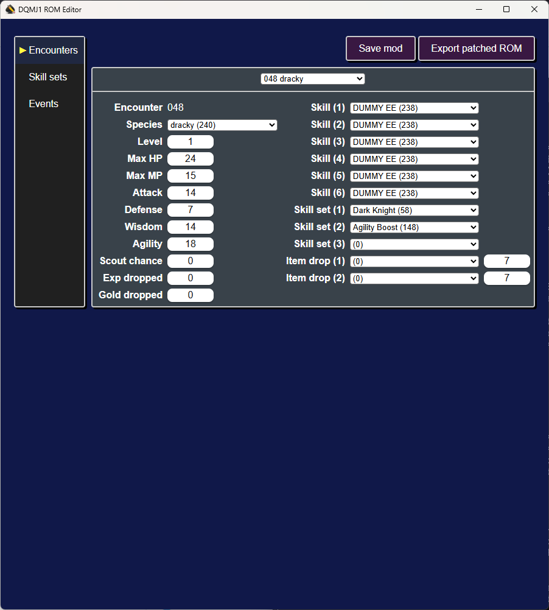

# DQMJ1 ROM Editor [](https://github.com/ExcaliburZero/dqmj1_rom_editor/actions/workflows/build.yml) [](https://qlty.sh/gh/ExcaliburZero/projects/dqmj1_rom_editor)
An unofficial modding tool / ROM editor for Dragon Quest Monsters Joker 1.

Currently only supports the North American and Japanese releases of the game, but I may add support for the European release at some point.



## Features
Currently supports modifying:

* Encounter tables (enemies, bosses, starter monsters, gift monsters)
* Skill sets
* Events (cutscenes, overworld areas) [experimental]

## Installation
Note that the ROM editor currently only supports Windows and Linux. I may add Mac support if there is interest.

### Windows
* Download the `.msi` installer file from the [releases page](https://github.com/ExcaliburZero/dqmj1_rom_editor/releases)
* Double click on the `.msi` installer to run it
* Follow the instructions in the installer
* Run the application from your desktop search bar (`dqmj1_rom_editor`)

### Linux
* Download your Linux file of choice (`.AppImage`, `.deb`, `.rpm`) from the [releases page](https://github.com/ExcaliburZero/dqmj1_rom_editor/releases)
  * I've only tested the `.AppImage`. If you encounter issues with any of them, [create an issue about it](https://github.com/ExcaliburZero/dqmj1_rom_editor/issues).
* Run / install your file of choice

## Keyboard shortcuts
* `Ctrl + s` / `Cmd + s` - Save mod
* `Ctrl + e` / `Cmd + e` - Export patched ROM

## Development
```bash
npm install
npm run tauri dev
```