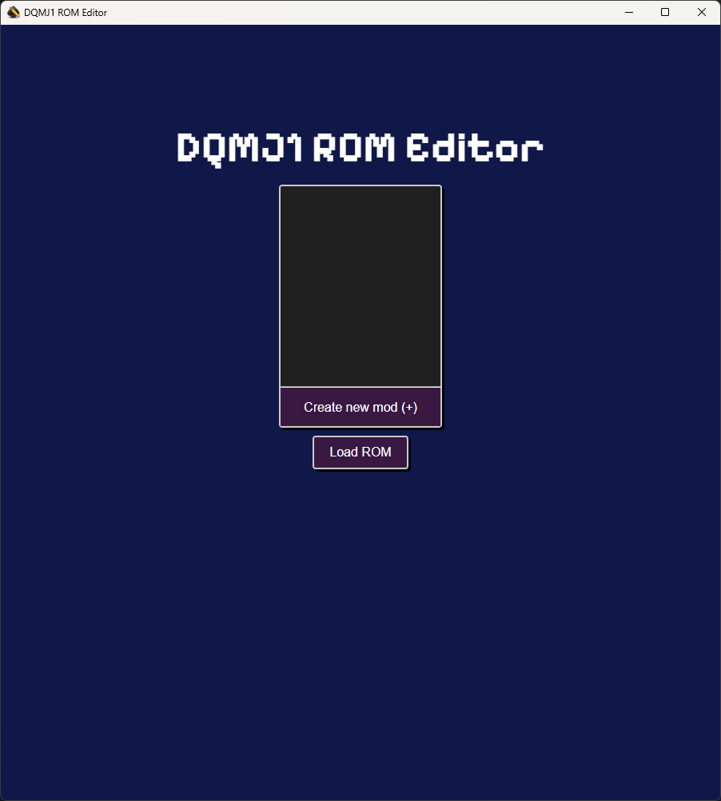
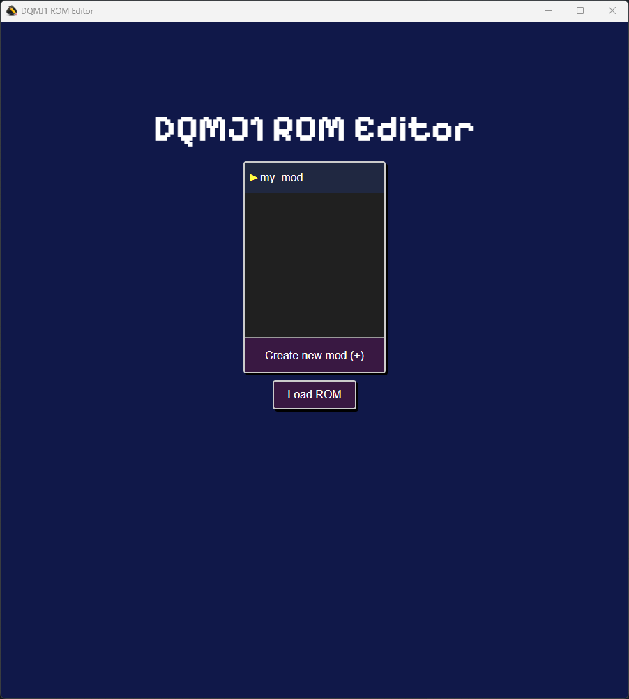

# Basics
When you open DQMJ1 ROM Editor, it will open to the Mod Selection window. Here you create a mod and load a ROM to begin making changes to the game.

## Create a mod
To create a mod, click on the `Create a new mod (+)` button and enter a name for the mod.

## Loading a ROM
Once you have created a mod and selected it, you can click on the `Load ROM` button to select a ROM to base your mod on.

Typically you'll want to select an original ROM for the game, but you can select an already modified ROM (ex. a [randomizer](https://github.com/ExcaliburZero/dqmj1_randomizer)).

After loading a ROM you will be able to make changes to it and save those changes as a mod.