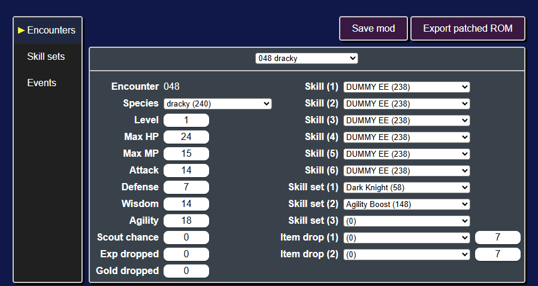
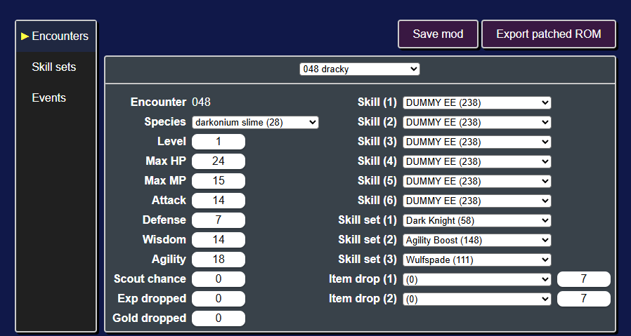
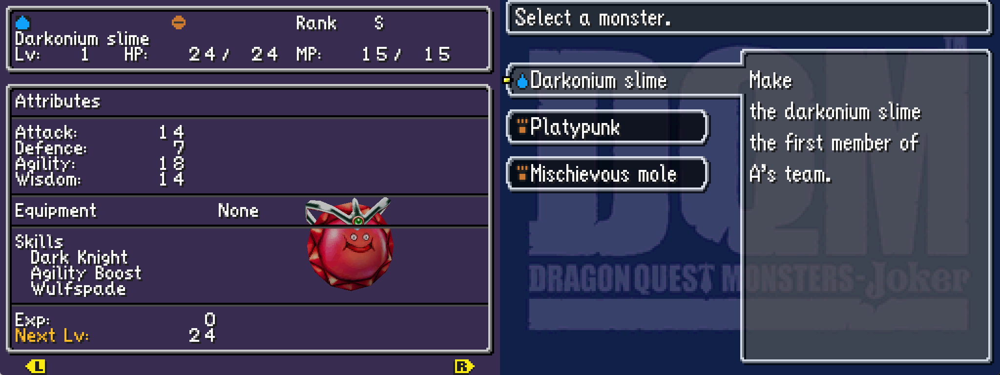
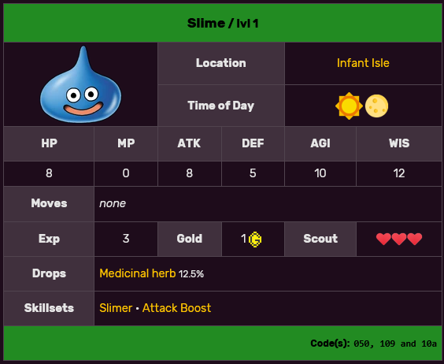
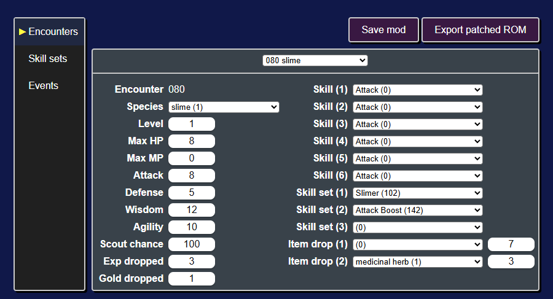
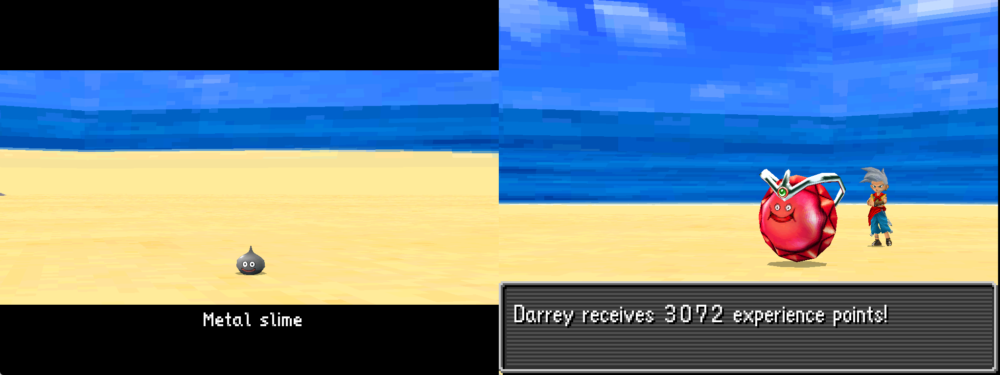

# Modifying encounters
The **encounters table** is a data file within the game that details all of the enemies, bosses, starter monsters, and gift monsters. Encounters determine monster's species, stats, moves, skill sets, etc..

Editing the encounters table will enable you to:

* Create new bosses
* Increase the difficulty of specific encounters
* Change the starter monsters
* and more!

<p align="center">

</p>

## Modifying a starter
As an example, let's change one of the starter monsters. The three starter monsters are in the table rows `048`, `049`, and `050`.

Let's edit encounter `048`, the starter Dracky.

Using the Species dropdown, we can change it from a Dracky to a Darkonium Slime. With the dropdown selected, you can start typing `darkonium` and `darkonium slime (28)` should be highlighted.

We can also give it a third skill set by clicking on the `Skill set (3)` dropdown and typing in `Wulfspade` to give it the Wulfspade skill set.

<p align="center">

</p>

At this point, it's a good idea to save the changes we made to the mod. To do that click on the `Save mod` button (or press `Ctrl + s`).

Next you should export the ROM with this change to the starter Dracky by clicking on the `Export patched ROM` button (or pressing `Ctrl + e`). Once you play up to point you get to choose your starter monster, you'll find the Darkonium Slime we created.

<p align="center">

</p>

## Modifying other encounters
To modify an encounter, you'll need to find its encounter id.

As a general rule of thumb:

| Category | Encounter ID range |
|----------|----------|
| Bosses | 1 - 39 |
| Starters & Gift Monsters | 44 - 74 |
| Scout/Rival Monsters | 304 - 378, 431 - 751 |

To find a particular encounter, a good first place to look is the [DQM:J Wiki](https://dqmj.fandom.com/wiki/Dragon_Quest_Monsters:_Joker_Wiki).

For example, on the [Slime](https://dqmj.fandom.com/wiki/Slime) page you can find an encounter listing for the slimes that appear on Infant Isle.

<p align="center">

</p>

The codes in the bottom right corner are encounter ids in hexadecimal (`050`, `109`, and `10a`). The ROM editor uses [decimal ids](https://www.rapidtables.com/convert/number/hex-to-decimal.html) (ex. `050 hex` = `080 decimal`).

Let's go to the first Slime encounter by clicking on the encounter select dropdown (in the top middle of the page) and typing in the encounter id (ex. `080`).

<p align="center">

</p>

Let's make it a metal slime! We'll change its species to `metal slime (6)` and its exp dropped to `3072`.

```admonish note
Make sure to make these changes for all three encounter ids (`080`, `265`, and `266`).
```

Next export the ROM and play up to Infant Isle.

<p align="center">

</p>

```admonish note
In the overworld the slimes still appear as slimes. This is because their overworld model and behavior is not controlled by the encounters table.
```

Next let's modify some skill sets!