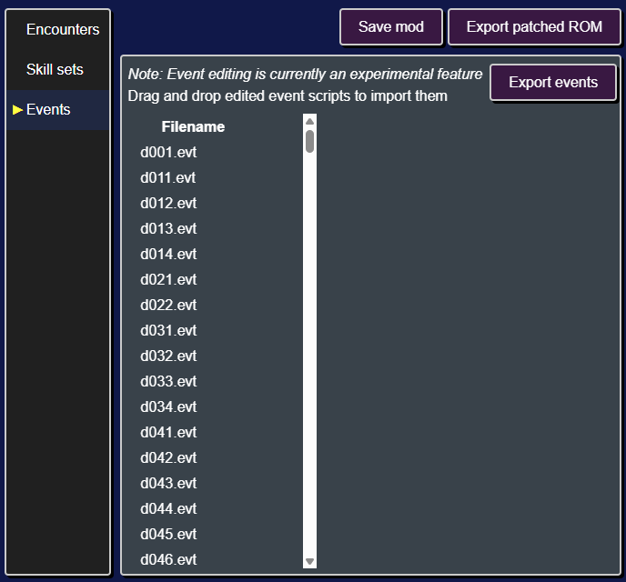
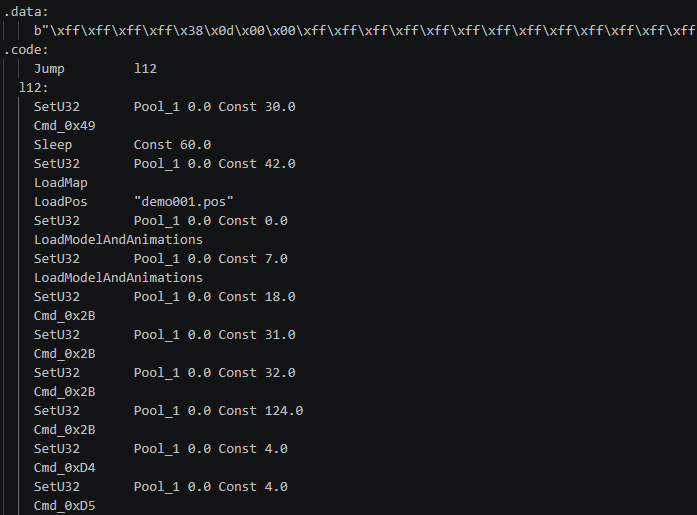
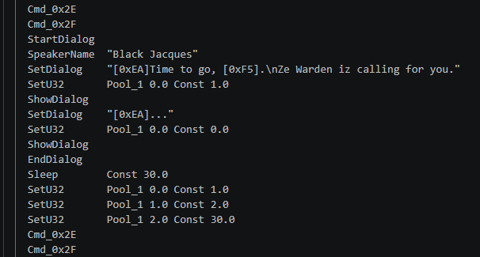
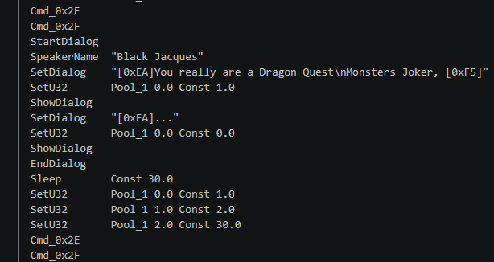
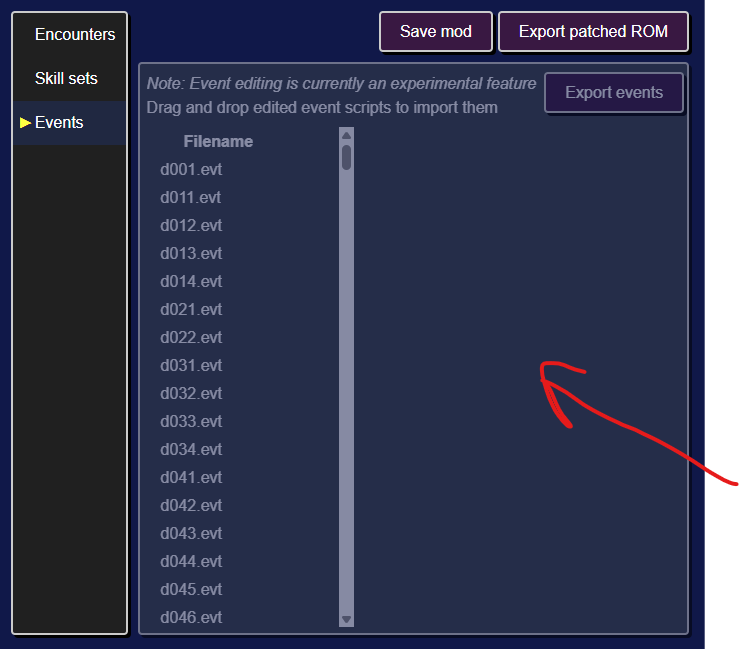
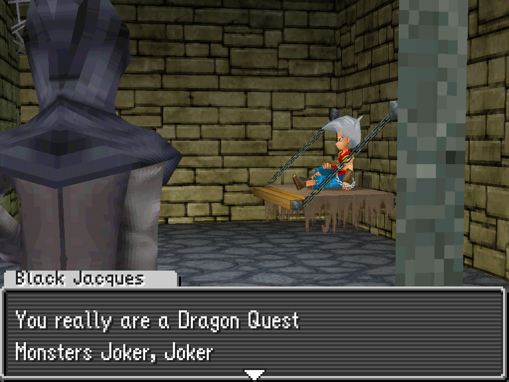

# Modifying event scripts
**Event scripts** are files that control cutscenes and overworld interactions.

Editing event scripts will enable you to:

* Add new cutscenes
* Make changes to existing cutscenes
* Make changes to overworld logic
* and more!

## Modifying an existing cutscene
As an example, let's change the dialogue in the opening cutscene.

### Exporting event scripts
First we'll need to export the game's event scripts.

After clicking on the "Events" tab, you'll see a list of event scripts on the left.

We can export all the scripts in one go by clicking on the `Export events` button and selecting a directory to write the scripts to.

### Editing the event
Next we'll need to find the event script for the opening cutscene.

Each of the event scripts starts with a prefix, in particular all cutscene script start with `demo`. In our case we need to edit `demo001.evt.dqmj1_asm`. The `.dqmj1_asm` extensions indicates that this is a disassembled event script for DQMJ1.

You can open up `demo001.evt.dqmj1_asm` in Notepad, VS Code, or any other text editor.

You can see that the file is divided into two sections: (1) a data section, and (2) a code section. For now we're only interested in the code section.

Each line of the code section is an instruction (ex. `Sleep Const 60.0`), which consists of a name (ex. `Sleep`) and arguments (ex. `Const 60.0`).

Since we want to modify some dialog, we can look through the file until we find an instruction that contains dialog. In particular looking for any instruction with the name `SetDialog`.

Let's go ahead and change the text for the first `SetDialog` instruction.

Then save the modified event script.

### Importing the modified event
Next we need to import the modified event script back into the ROM editor.

To do this, select the modified `demo001.evt.dqmj1_asm` file in your file browser and click and drag it onto the main section of the ROM editor.

Then save the mod, export the ROM, and start a new game.

During the opening cutscene you'll see the updated dialog.

