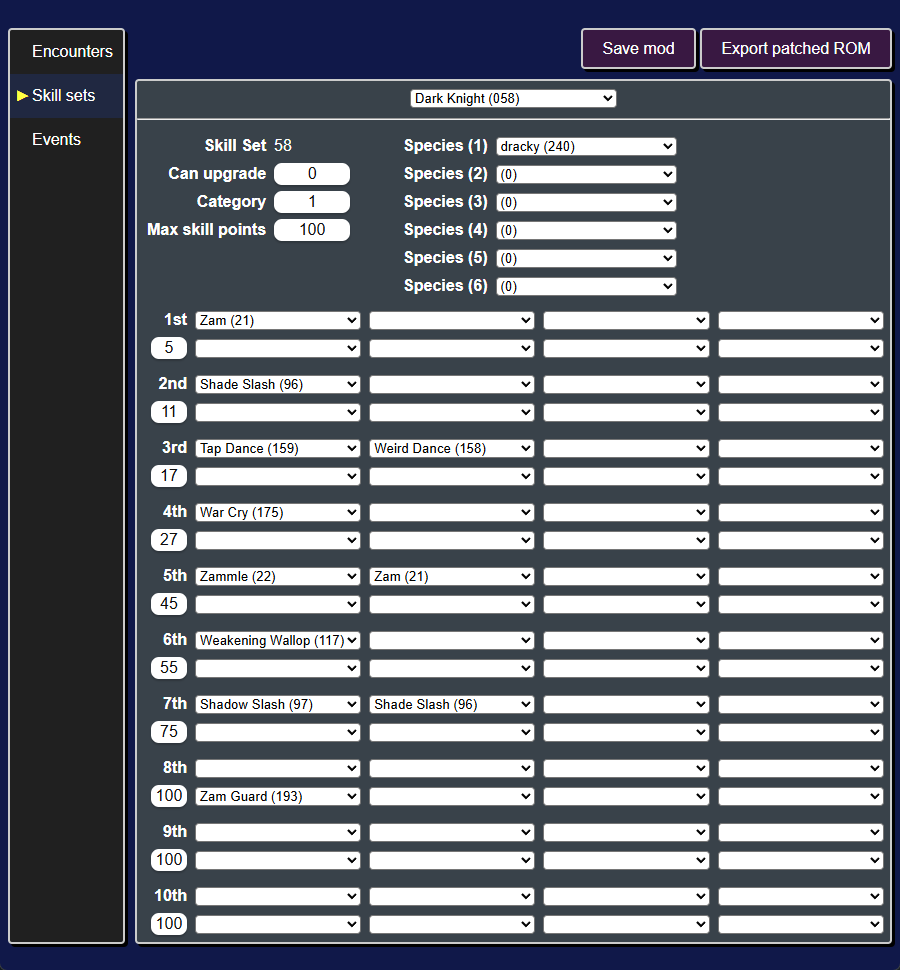
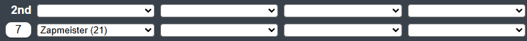
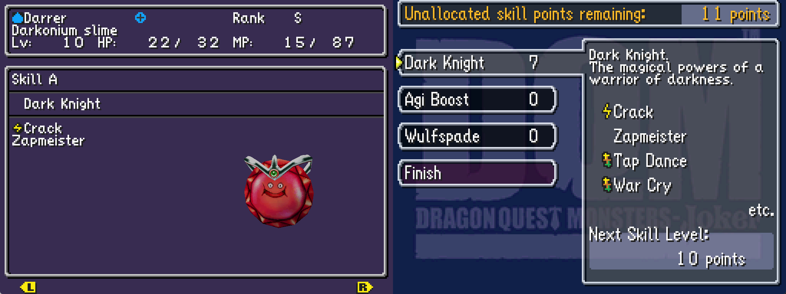

# Modifying skill sets
The **skill set table** is a data file within the game that details the rewards for allocating skill points into specific skill sets. Each skill set reward level has a skill point requirement and one or more skills, traits, or stat increases they reward.

Editing the skill sets table will enable you to:

* Create custom skill sets
* Re-balance existing skill sets

<p align="center">

</p>

## Modifying a skill set
As an example, let's change one of the skill sets that a starter monster has.

Let's edit Dark Knight (`058`), since the starter Dracky has it.

First click on "Skill sets" to switch to that tab. By default it will already show the Dark Knight skill set.

We'll make two different changes to this skill set:

| Reward level | Skill Points | Skills | Traits |
|--------------|--------------|--------|--------|
| 1 | 5 -> **3** | Zam (21) -> **Crack (13)** | - |
| 2 | 11 -> **7** | Shade Slash (96) -> *None* | *None* -> **Zapmeister (21)** |

### Level 1 -> Crack
First we'll change the reward level 1 to require only 3 skill points and reward Crack. To do this, you'll need to edit the row marked "1st" and the row below it.

1. The box below "1st" is the number of skill points required, so we'll change that from 5 to 3.
2. The boxes to the right of "1st" are the skills rewarded, so we'll change the first one from "Zam (21)" to "Crack (13)".

<p align="center">

</p>

### Level 2 -> Zapmeister
Next we'll change the reward level 2 to require only 7 skill points and reward the Zapmeister trait. This time we'll be editing the row marked "2nd" and the row below it.

1. Like before, we'll change the number of skill points required from 11 to 7.
2. The boxes to the right of the number of skill points are the traits rewarded, so we'll set the first one to "Zapmeister (21)".
3. We'll also need to set the skill box next to "2nd" to empty (first option in the dropdown).

<p align="center">

</p>

### Testing ingame
Next we'll save the mod (`Ctrl + s`) and export the ROM (`Ctrl + e`).

Pick the first starter, get to Infant Isle, and fight monsters until you get at least 7 skill points.

Then you'll be able to allocate those skill points to the Dark Knight skill set and obtain Crack and Zapmeister.

<p align="center">

</p>

```admonish note
In this tutorial, we have avoided adding any skill increases or multiple skills/traits at the same reward level. Both of these things are possible, but the exact conditions for them working correctly are not yet known.

It seems that the category of the skill set affects how many stat increases a skill set can have. It also seems that multiple skills/traits for the same reward level serve to encode "skill/trait" upgrades (ex. Frizz upgrading to Frizzle).
```

Next let's modify some event scripts to make changes to cutscenes.