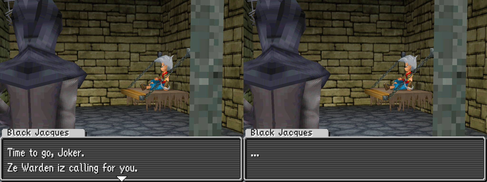
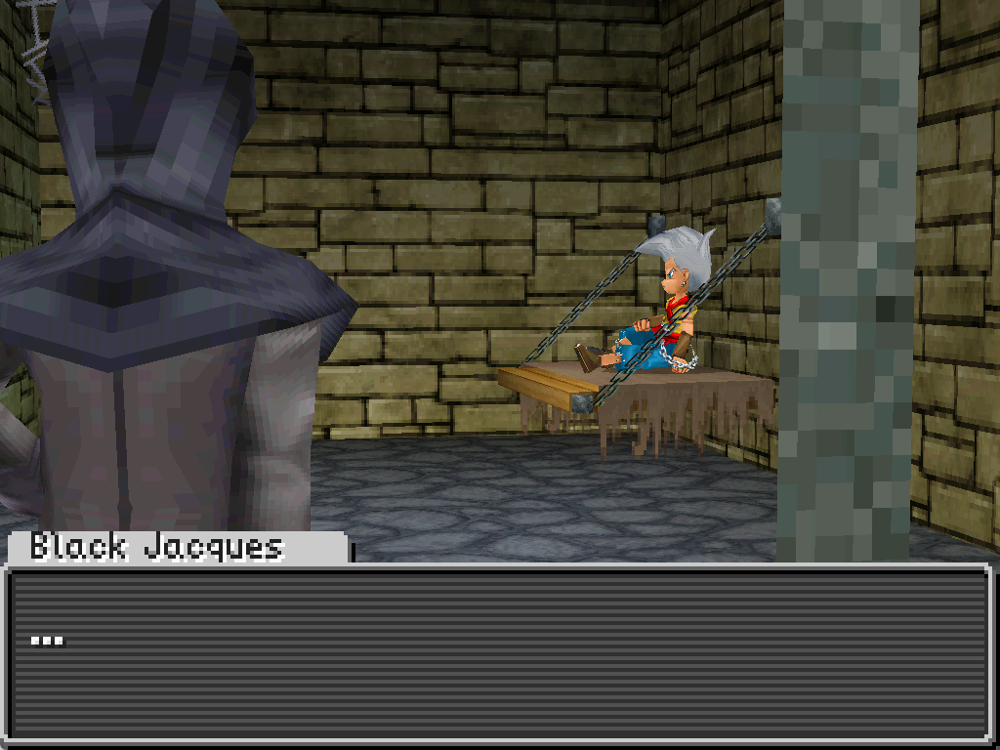

# Dialog
**Dialog** boxes allow you to show the player character dialog or other text.

```
StartDialog 
SpeakerName  "Black Jacques"
SetDialog    "[0xEA]Time to go, [0xF5].\nZe Warden iz calling for you."
SetU32       Pool_1 0.0 Const 1.0
ShowDialog  
SetDialog    "[0xEA]..."
SetU32       Pool_1 0.0 Const 0.0
ShowDialog  
EndDialog   
```

<p align="center">

</p>

## Overall structure
Each section of dialog has the following basic structure of [instructions](instructions.md):

* `StartDialog` starts the dialog section
* `SpeakerName` determines the character name shown for the dialog boxes (optional)
* `SetDialog` sets the text of the dialog
* `ShowDialog` shows the dialog onscreen until the player presses the A button
* `EndDialog` ends the dialog section

A dialog section can contain multiple `SetDialog`/`ShowDialog` pairs between a single `StartDialog` and `EndDialog`.

### Example 1
As an example, consider the following dialog section:

```
StartDialog 
SpeakerName  "Black Jacques"
SetDialog    "[0xEA]..."
SetU32       Pool_1 0.0 Const 0.0
ShowDialog  
EndDialog   
```

In this case the speaker name is `Black Jacques` and the text shown in the dialog box is `...`. All text must be surrounded in double quotes `"`
 to indicate that it is text.

<p align="center">

</p>

Looking at the text in the `SetDialog` instruction, you'll notice that it starts with `[0xEA]`. This is a [control code](#control-codes). In this case, it indicates that the text is for a conversation. Most conversation text will start with `[0xEA]`, though there are some cases where it may start with a another control code (such as `[0xEB]`).

```
SetDialog    "[0xEA]..."
```

You'll also notice that before the `ShowDialog` instruction that there is a `SetU32` instruction. This controls whether the dialog advance triangle appears at the bottom of the dialog box. Using `1.0` at the end shows the triangle, while using `0.0` hides it. See [Value pools](value_pools.md) for a more detailed explanation of `SetU32`.

```
SetU32       Pool_1 0.0 Const 0.0
ShowDialog  
```

### Example 2
As another example, consider this actual dialog section from the first cutscene of the game:

```
StartDialog 
SpeakerName  "Black Jacques"
SetDialog    "[0xEA]Time to go, [0xF5].\nZe Warden iz calling for you."
SetU32       Pool_1 0.0 Const 1.0
ShowDialog  
SetDialog    "[0xEA]..."
SetU32       Pool_1 0.0 Const 0.0
ShowDialog  
EndDialog   
```

<p align="center">

</p>

Here we can notice a few things:

* `SpeakerName` only needs to be used once, even if the character has multiple dialog boxes
* In the first `SetDialog`, there are two interesting parts:
    * `\n` is used to start a new line of dialog in the same dialog box
    * `[0xF5]` is the [control code](#control-codes) used to insert the player's name
* The dialog advance triangle is used for the first dialog box, but not the second
    * `Const 1.0` vs `Const 0.0` for the `SetU32` instructions

```admonish note
We haven't shown how to use dialog prompts (ex. Yes or No). Those are covered in the [Jumps and Conditionals](jumps_and_conditionals.md) page.
```

## Control codes
Control codes are special pieces of text that instruct the game to display specific information within dialog text or use a particular effect in displaying the text of the dialog box.

| Code | Purpose |
|------|---------|
| `[0xD0]` | Starts a non-conversational dialog (ex. for opening a treasure chest) |
| `[0xEA]` | Starts a conversational dialog |
| `[0xEB]` | Used to start some conversational dialog (exact behavior unclear) |
| `[0xF5]` | Inserts the player's name |