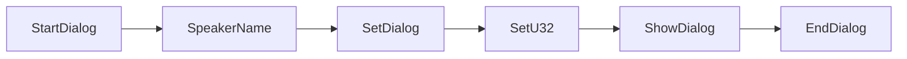
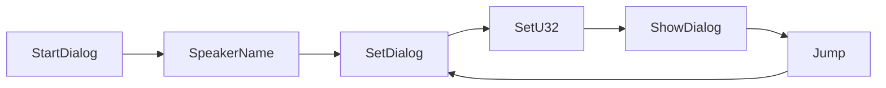
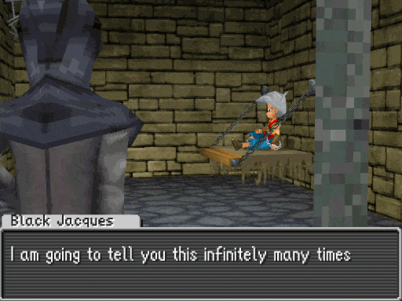
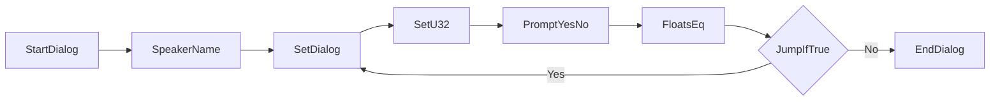
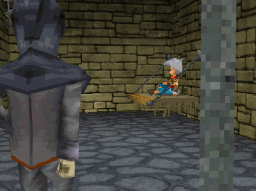
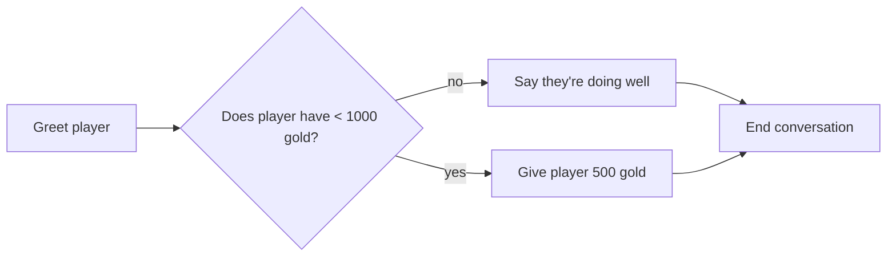

# Jumps and conditionals
**Jumps and conditionals** are used to make cutscenes and overworld events react to player choices or game state.

* Different dialog or cutscene outcome based on a yes/no choice
* Different outcomes based on the player's gold or items
* Repeat a dialog box until the player gives the correct answer

## Jumps
**Jumps** are a special type of instruction that instead of causing the event to move on to the next instruction after it, move the event to a specific instruction.

Consider the following example: (We've indented the instructions in this example for clarity)

```
    StartDialog 
    SpeakerName  "Black Jacques"
    SetDialog    "[0xEA]I am only going to tell you this once"
    SetU32       Pool_1 0.0 Const 1.0
    ShowDialog  
    EndDialog   
```

In this case, the instructions run one after another:



Let's add in a `Jump` and see how it affects what the event does:

```
    StartDialog 
    SpeakerName  "Black Jacques"
loop_start:
    SetDialog    "[0xEA]I am going to tell you this infinitely many times"
    SetU32       Pool_1 0.0 Const 1.0
    ShowDialog  
    Jump loop_start
    EndDialog 
```

Note that there are two changes here:

1. The `loop_start:` line before the `SetDialog`, these types of lines are called **labels**
2. The `Jump loop_start` after the `ShowDialog`

The instructions will run one after another, but when the `Jump` instruction is reached the event will move back to the `SetDialog` instead of moving forward to the `EndDialog`. Specifically, it will go back to the `SetDialog` because the `Jump` command has the `loop_start` label as its first argument and the `loop_start` label is placed directly before the `SetDialog`.



This behavior where an event script repeats the same set of instructions more than once is called a **loop**.

<p align="center">

</p>

```admonish note
This particular example will make the "I am going to tell you this infinitely many times" dialog box appear over and over again without end, trapping the game in an **infinite loop**.

We'll fix this in the next section.
```

### Types of jumps
| Instruction | Description |
|-------------|-------------|
| Jump | Jumps to the specified label |
| JumpIfTrue | Jumps to the specified label if previous conditional is true |
| JumpIfFalse | Jumps to the specified label if previous conditional is false |
| JumpKeepBackPointer | Jumps to the specified label and keep track of where the following instruction is |

```admonish note
`JumpKeepBackPointer` enables jumping to a different part of the script, and jumping back using `Exit`.

This will be covered in an upcoming later section of the guide.
```


## Conditionals
**Conditionals** allow you to control where the event will go after a jump instruction. This will enable you to make events react to player choices and game state.

### Player choice & controlling loops
As shown in the previous section, we can use a `Jump` instruction to repeat a dialog box. Let's use a conditional to make the dialog box stop after the player selects a "No" choice.

```
    StartDialog 
    SpeakerName  "Black Jacques"
loop_start:
    SetDialog    "[0xEA]Do you want me to say this again?"
    SetU32       Pool_1 0.0 Const 1.0
    PromptYesNo
    FloatsEq Pool_1 0.0 Const 1.0
    JumpIfTrue loop_start
    EndDialog 
```

Note that there are three main changes here:

1. Changes the `ShowDialog` to `PromptYesNo`. This both shows the dialog and gives the player a Yes or No choice, storing `1.0` in `Pool_1[0]` if the player chose "Yes", or `0.0` if the player chose "No".
    * Note that like `ShowDialog`, `PromptYesNo` also shows the dialog advance triangle if `Pool_1[0]` is equal to `1.0`.
2. The `FloatsEq Pool_1 0.0 Const 1.0`. This is a conditional, which checks if the value in `Pool_1[0]` is equal to `1.0`.
3. The `Jump` has been changed to `JumpIfTrue`. This will move the event to `SetDialog` if the previous conditional was true, or move the event to `EndDialog` if the previous conditional was false.

By adding these instructions, we have created a loop that will repeat if the player selects "Yes" and end when the player selects "No".



<p align="center">

</p>

### Game state
In addition to controlling loops, conditionals enable you to have events behave differently based on game state (ex. player's gold, items, library completion, etc.).

As an example of this, let's make a script that gives the player 500 gold if they have less than 1000 gold.

Here's the script behavior we want to achieve:



As a part of this, we will use the `GetPlayerGold` instruction. It will set `Pool_1[0]` to the amount of gold the player currently has.

```
    StartDialog 
    SpeakerName  "Generous Individual"
    SetDialog    "[0xEA]How are you doing on this fine day?"
    SetU32       Pool_1 0.0 Const 1.0
    ShowDialog
    GetPlayerGold
    FloatsLess Pool_1 0.0 Const 1000.0
    JumpIfTrue in_need_of_money
    SetDialog    "[0xEA]Seems like you're doing well for yourself!"
    SetU32       Pool_1 0.0 Const 1.0
    ShowDialog
    Jump conversation_end
in_need_of_money:
    SetDialog    "[0xEA]You could be doing better.\nHere, take this and buy some ice cream!"
    SetU32       Pool_1 0.0 Const 1.0
    ShowDialog
    SetU32       Pool_1 0.0 Const 500.0
    GivePlayerGold
conversation_end:
    EndDialog 
```

Here we use `JumpIfTrue` to go to the `in_need_of_money` label if the player's gold is less than 1000. If the player has 1000 or more gold, then the script instead continues on to the "Seems like ..." dialog and uses a `Jump` to go to `conversation_end`. This results in both paths ending up at `conversation_end`.

### Types of conditionals
| Instruction | Description |
|-------------|-------------|
| FloatsEq | Checks if two values are equal |
| FloatsNeq | Checks if two values are not equal |
| FloatsGreater | Checks if the first value is greater than the second |
| FloatsLess | Checks if the first value is less than the second |
| FloatsGreaterEq | Checks if the first value is greater than or equal to the second |
| FloatsLessEq | Checks if the first value is less than or equal to the second |
